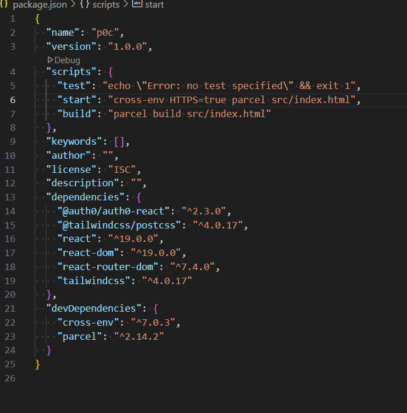
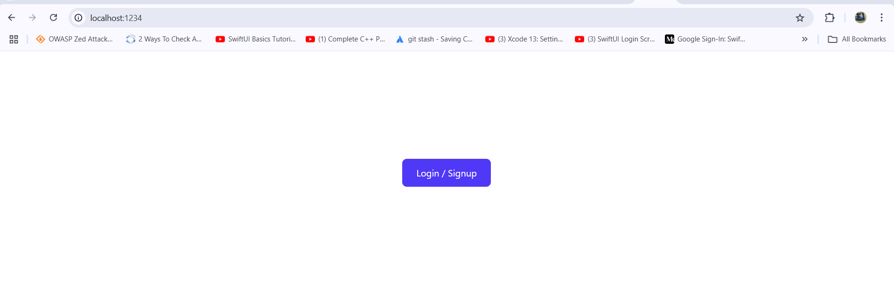
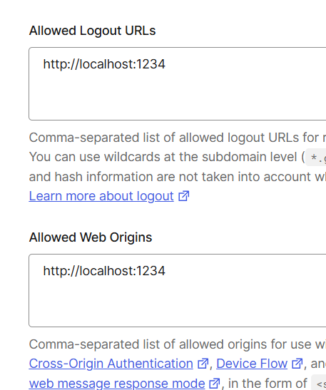
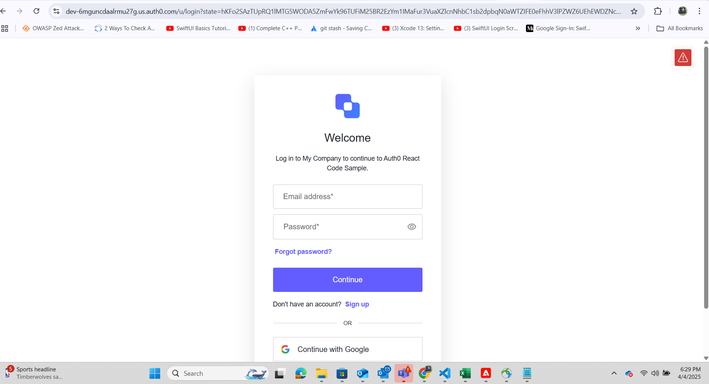
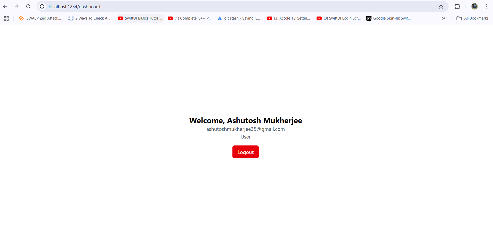

Proof of Concept for integrating Auth0 authentication system in your React application.

We are creating a POC where we integrate the Auth0 API with a login button in our React application that will authenticate the user and based on the authentication result the user will be shown a page.

 We set up the React Project using Parcel as the bundler  Here's the configuration of the project.

We followed this documentation https://developer.auth0.com/resources/guides/spa/react/basic-authentication#quick-react-setup for integrating the Auth0 authentication.

Kicking off the POC I created a Landing page with a Login/Sign up button. I created a dashboard page where the user will be redirecting upon clicking the button.

 Use case is there should be an authentication when the user clicks on the button . If the user is authenticated then the user should be redirected to the dashboard page. If the user is not authenticated then the user should be shown the error in authentication process. The landing page looks like this
 

 We set the auth0 dashboard to have the following settings as shown in the image
  this is the same url in which your react application is hosted. All the routing needs to be handled from the app and not from the

Upon clicking the Login button the user will be redirected to the Auth0 login page. Upon successful authentication the user will be redirected

This happens because an API call takes place and once the user is authenticated the user is redirected to the dashboard page. The dashboard page looks like this
